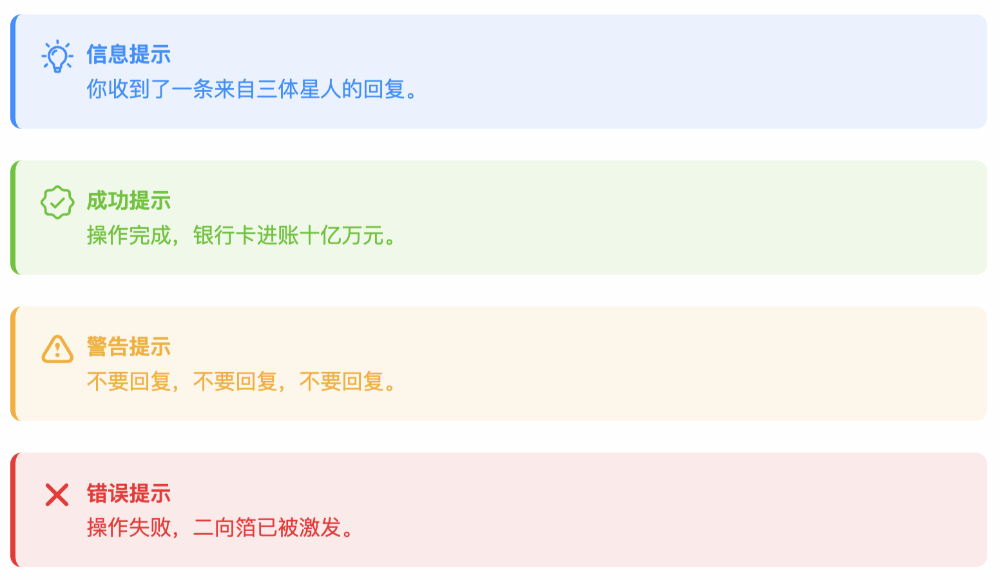

# Minimal

<div align="center">
<a href="https://github.com/Bugorf/halo-theme-minimal/releases"></a>
<a href="https://halo.run">=2.20-red.svg", alt="github"></a>

</div>

一款专为Halo框架设计的博客主题，以清爽和美观为主的极简风格。摒弃冗余功能，专注内容创作。本主题目前处于开发测试阶段，后续将会陆续新增其他特性和扩展现有功能，欢迎体验。


目前正在积极学习Halo的技术栈，包括但不限于Thymeleaf，Tailwindcss，vite。遇到的坑不算少，不过老话说的好，打不死的终会让我更加强大，痛并快乐着 ╮(╯▽╰)╭

部分功能实现参考Halo默认主题 [Earth](https://github.com/halo-dev/theme-earth)，在此由衷表示感谢。

## 效果预览可前往 👉 [𝓜.𝓦𝓱𝓲𝓽𝓮’𝓼 𝓫𝓵𝓸𝓰](https://alloworld.me)

# 💪 TODO

- ⬜️ I18n适配
- ✅ 评论系统
- ✅ 移动设备UI适配
- ✅ 深色模式
- ⏳ 图标适配（iconify）
- ⏳ UI，交互改良
- ✅ 文章目录
- ⬜️ 表格，代码模块
- ⬜️ 分享,点赞按钮
- ✅ 版权声明模块
- ✅ 底部导航栏
- ✅ 总字数统计
- ✅ Prism.js自定义代码高亮（详见下文）
- ⬜️ 过时提醒

# 😎 使用

<p>
直接下载<a href="https://github.com/Bugorf/halo-theme-minimal/releases"></a>
压缩包，后台上传即可。具体安装方式可参考<a href="https://docs.halo.run/user-guide/themes">Halo官方教程</a>
</p>

- ## ⚠️ 提示条，折叠块使用注意事项

    `某些组件效果只能依靠插件实现，但是目前并没有开发插件的想法。光主题就已经让人头大了。也许之后有机会可以尝试...`

    目前可通过插入以下格式化代码用于对应组件，效果如下:
    

  ### 提示条 - Info

    ```html
        <div class="alert alert-info">
            <div class="alert-content">
                <strong>信息提示</strong><br>
                你收到了一条来自三体星人的回复。
            </div>
        </div>
    ```

  ### 提示条 - Success

    ```html
        <div class="alert alert-success">
            <div class="alert-content">
                <strong>成功提示</strong><br>
                操作完成，银行卡进账十亿万元。
            </div>
        </div>
    ```

  ### 提示条 - Warning

    ```html
        <div class="alert alert-warning">
            <div class="alert-content">
                <strong>警告提示</strong><br>
                不要回复，不要回复，不要回复。
            </div>
        </div>
    ```

  ### 提示条 - Error

    ```html
        <div class="alert alert-error">
            <div class="alert-content">
                <strong>错误提示</strong><br>
                操作失败，二向箔已被激发。
            </div>
        </div>
    ```

  ### 折叠块

    ``` html
        <div class="clp">
        <div class="clp-header" onclick="toggleCollapse(this)">
            <span>标题</span>
            <span class="clp-icon">▼</span>
        </div>
        <div class="clp-content">
            <div class="clp-inner">
                <p>这里放内容</p>
            </div>
        </div>
    </div>
    ```

- ## ⚠️ Prism.js使用注意事项

    官方的代码高亮插件没有适配深色模式，遂决定使用其他第三方库。网上搜罗一圈，发现Prism.js是一个不错的选择。

    高亮显示已适配深色模式，可通过切换深色模式按钮实时生效，无需刷新页面，以下是具体效果：

    |浅色模式|深色模式|
    |---|---|
    |||

    👀 颜色可自定义，对应CSS样式位于 assets -> content.css

    本主题额外添加了Prism.js三个比较实用的插件，分别是：
  - 高亮插件，支持自定义颜色。
    

  - 文件树视图插件
    

  - 命令行模拟插件
    

  ### 高亮

    ```html
        <pre class="line-numbers" data-line="4-5, 8,11,14,17,20,23-25" m-info="11" m-success="14" m-warning="17" m-error="20,23-25"> 
            <code class="language-javascript">

                //普通多行高亮
                console.log("Allo");
                console.log("World");

                //普通单行高亮
                console.log("ok");

                // info高亮
                alert("Info !");

                // Success高亮
                alert("Success !");

                // Warning高亮
                alert("Warning !");

                // Error高亮
                alert("Fetal error !");

                // 自定义多行高亮
                alert("Fetal error: ");
                alert("A huge bug");
                alert("was born !!");
            </code>
        </pre>
    ```

  ### 文件树

    ```html
        <pre class="language-treeview">
            <code>
                root_folder/
                ├── a_file.txt
                ├── subfolder/
                │   ├── nested_file.txt
                │   └── another_file.txt
                └── last_file.txt
            </code>
        </pre>
    ```

  ### 命令行

    ```html
        <pre class="command-line language-bash" data-user="chris" data-host="remotehost" data-output="2, 4-8" tabindex="0">
            <code class="language-bash">pwd
                /usr/home/chris/bin
                ls -la
                total 2
                drwxr-xr-x   2 chris  chris     11 Jan 10 16:48 .
                drwxr--r-x  45 chris  chris     92 Feb 14 11:10 ..
                -rwxr-xr-x   1 chris  chris    444 Aug 25  2013 backup
                -rwxr-xr-x   1 chris  chris    642 Jan 17 14:42 deploy
            </code>
        </pre>
    ```

# 🔬 开发

```
git clone https://github.com/Bugorf/halo-theme-minimal.git ~/halo2/themes/halo-theme-minimal
```

```
cd ~/halo2/themes/halo-theme-minimal
```

```
pnpm install
```

```
pnpm dev
```
